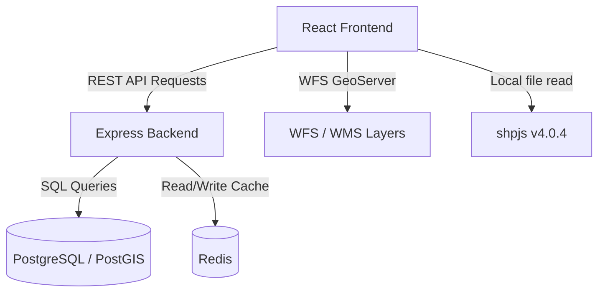
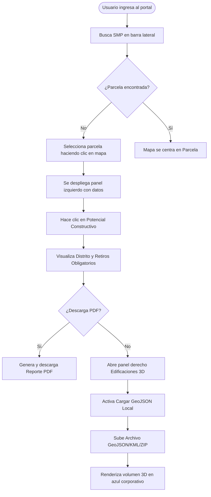
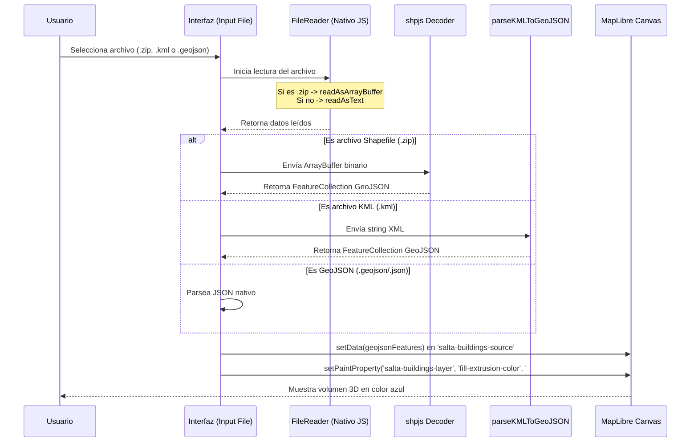
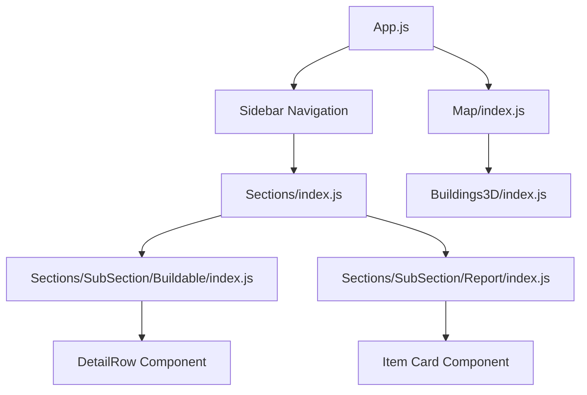

# Documentación Técnica e Instructivo de Usuario - Salta3D

Este documento detalla el funcionamiento del portal web Salta3D, desarrollado para la Municipalidad de Salta. Contiene tanto la documentación dirigida al usuario final (enfoque de Experiencia de Usuario - UX) como la documentación técnica para desarrolladores (arquitectura, flujos, análisis de código y mantenimiento del sistema).

---

## Índice General

1. [PARTE 1: Documentación para el Usuario (UX)](#1-parte-1-documentación-para-el-usuario-ux)
   - [Objetivo de la Funcionalidad](#objetivo-de-la-funcionalidad)
   - [Casos de Uso Principales](#casos-de-uso-principales)
   - [Flujo de Navegación Paso a Paso](#flujo-de-navegación-paso-a-paso)
   - [Descripción de la Interfaz (Botones, Iconos y Acciones)](#descripción-de-la-interfaz-botones-iconos-y-acciones)
   - [Entradas Requeridas por el Usuario](#entradas-requeridas-por-el-usuario)
   - [Resultados Esperados](#resultados-esperados)
   - [Manejo de Errores y Resolución](#manejo-de-errores-y-resolución)
   - [Buenas Prácticas de Uso](#buenas-prácticas-de-uso)
2. [PARTE 2: Documentación para el Desarrollador (UI / Arquitectura Técnica)](#2-parte-2-documentación-para-el-desarrollador-ui--arquitectura-técnica)
   - [Arquitectura General](#arquitectura-general)
   - [Estructura de Carpetas Involucradas](#estructura-de-carpetas-involucradas)
   - [Archivos Principales y su Responsabilidad](#archivos-principales-y-su-responsabilidad)
   - [Librerías y Dependencias del Proyecto](#librerías-y-dependencias-del-proyecto)
   - [Variables y Archivos de Configuración](#variables-y-archivos-de-configuración)
   - [Componentes React y Hooks Involucrados](#componentes-react-y-hooks-involucrados)
   - [Consumo de APIs y Servicios Geográficos (WFS/REST)](#consumo-de-apis-y-servicios-geográficos-wfsrest)
   - [Recursos Gráficos y Estilos CSS](#recursos-gráficos-y-estilos-css)
   - [Convenciones de Nombres](#convenciones-de-nombres)
3. [PARTE 3: Análisis del Código](#3-parte-3-análisis-del-código)
   - [Funciones Más Importantes y Propósitos](#funciones-más-importantes-y-propósitos)
   - [Bloques Críticos del Código](#bloques-críticos-del-código)
   - [Puntos de Mejora y Buenas Prácticas Sugeridas](#puntos-de-mejora-y-buenas-prácticas-sugeridas)
   - [Riesgos Técnicos y Consideraciones de Rendimiento](#riesgos-técnicos-y-consideraciones-de-rendimiento)
4. [PARTE 4: Diagramas Técnicos (Mermaid)](#4-parte-4-diagramas-técnicos-mermaid)
   - [Flujo de Navegación del Usuario](#flujo-de-navegación-del-usuario)
   - [Flujo de Procesamiento y Carga de Archivos Locales](#flujo-de-procesamiento-y-carga-de-archivos-locales)
   - [Arquitectura y Jerarquía de Componentes React](#arquitectura-y-jerarquía-de-componentes-react)
5. [PARTE 5: Resumen Técnico del Sistema](#5-parte-5-resumen-técnico-del-sistema)

---

## 1. PARTE 1: Documentación para el Usuario (UX)

### Objetivo de la Funcionalidad
El portal Salta3D permite a los ciudadanos, agrimensores, arquitectos y desarrolladores urbanos visualizar catastros en tres dimensiones, consultar los indicadores urbanísticos vigentes del Código de Planeamiento Urbano Ambiental (CPUA) de la Municipalidad de Salta, evaluar el potencial constructivo de cada parcela y descargar el Reporte Parcelario oficial en PDF. Además, cuenta con la capacidad de cargar y previsualizar archivos espaciales locales en 3D (GeoJSON, KML y Shapefile ZIP) de forma inmediata.

### Casos de Uso Principales
- **Consulta Catastral y de Zonificación**: Buscar una parcela mediante su SMP (Sección Manzana Parcela) o navegando por el mapa interactivo para conocer su distrito urbanístico y su superficie catastral.
- **Estudio de Potencial Constructivo**: Analizar las capacidades máximas edificables de un terreno calculadas sobre su superficie (F.O.S. máximo en metros cuadrados, pisos teóricos estimados, superficie edificable privada y pública con bonificación).
- **Consulta de Retiros de Construcción**: Verificar qué retiros obligatorios (retiro de jardín, de fondo, lateral, de perfil, etc.) aplican a la parcela.
- **Exportación de Reporte oficial**: Generar un documento PDF con toda la información catastral, indicadores urbanísticos y potencial constructivo del terreno consultado.
- **Validación de Volúmenes Externos (Visualización 3D)**: Cargar un proyecto local en formato GeoJSON, KML o Shapefile (ZIP) para verificar su impacto volumétrico renderizado sobre la cartografía 3D de la ciudad.

### Flujo de Navegación Paso a Paso
1. **Inicio de Búsqueda**: El usuario ingresa a la aplicación. En el panel izquierdo, puede realizar una búsqueda catastral ingresando el código SMP.
2. **Selección de la Parcela**: Al seleccionar una parcela, el mapa se centra automáticamente y resalta el terreno.
3. **Visualización de Potencial Constructivo**: En la barra lateral izquierda, al hacer clic en **Potencial Constructivo**, el usuario visualiza el resumen: el nombre del Distrito correspondiente, la superficie, los coeficientes F.O.T. (Privado y Público), la Altura Máxima en metros y el listado completo de retiros obligatorios vigentes.
4. **Descarga de PDF**: En la sección de Reportes, el usuario hace clic en el icono del PDF para exportar la ficha completa.
5. **Carga de Archivos 3D Externos**:
   - Abrir el panel flotante derecho de **Edificaciones 3D**.
   - Activar la casilla **"Cargar GeoJSON Local"**.
   - Presionar **"Subir Archivo"** y seleccionar un archivo `.geojson`, `.json`, `.kml` o `.zip` (que contenga los archivos `.shp`, `.dbf`, etc. comprimidos).
   - El mapa cambiará de perspectiva automáticamente y renderizará el volumen del archivo en color azul corporativo (**`#004174`**).

### Descripción de la Interfaz (Botones, Iconos y Acciones)
| Elemento / Botón | Icono | Acción / Función |
| :--- | :--- | :--- |
| **Buscador Catastral** | Lupa | Inicia la búsqueda por número de SMP. |
| **Botón de Edificaciones 3D** | Edificio (`ApartmentIcon`) | Abre/cierra el panel de configuraciones 3D. |
| **Switch Mostrar 3D** | Interruptor | Activa o desactiva la capa volumétrica de edificios en el mapa y la inclinación de cámara. |
| **Switch Cargar GeoJSON Local**| Interruptor | Alterna la fuente de datos entre los servidores del municipio (WFS) y archivos locales. |
| **Botón Subir Archivo** | Nube (`CloudUploadIcon`) | Abre el explorador de archivos del sistema para cargar archivos en formato `.geojson`, `.json`, `.kml`, `.zip`. |
| **Icono de Descarga PDF** | PDF (`reporte_parcelario_pdf.png`)| Inicia la generación e inicio de descarga automática del Reporte Parcelario Oficial en PDF. |

### Entradas Requeridas por el Usuario
- **Para Búsquedas**: Código SMP (ej. `01-02-03-04`).
- **Para Visualización 3D Local**: Archivos espaciales que contengan coordenadas poligonales válidas (`EPSG:4326` o coordenadas geográficas).
  - *Shapefiles*: Deben subirse comprimidos en un archivo `.zip` que contenga obligatoriamente los archivos `.shp` y `.dbf` con el mismo nombre base.

### Resultados Esperados
- **Consulta Web**: Ficha detallada con datos catastrales estructurados y listado explícito de retiros (incluso mostrando `NULL` cuando el indicador no aplique).
- **Visualización 3D**: Representación tridimensional extruida de los polígonos cargados, coloreados en azul (`#004174`) para diferenciar los nuevos volúmenes propuestos frente a los grises existentes.
- **Reporte PDF**: Documento ordenado con firma oficial de la Municipalidad, resumen de indicadores y libre de la "Nota de Estimación" obsoleta.

### Manejo de Errores y Resolución
- **"Error al leer el archivo Shapefile (ZIP)..."**: Ocurre si el archivo `.zip` no contiene un `.shp` o `.dbf` legible, o si el archivo está corrupto. *Resolución*: Verifica que el archivo ZIP provenga directamente de una herramienta GIS y contenga todos los metadatos necesarios en la raíz de la compresión.
- **"Error al leer el archivo KML..."**: Ocurre si el XML está mal formado o no posee etiquetas `<Polygon>` estructuradas. *Resolución*: Verifica que el KML tenga placemarks poligonales con coordenadas explícitas.
- **Superficie Catastral no disponible**: Se presenta cuando el catastro seleccionado carece de dimensiones en la base de datos municipal. *Resolución*: El sistema no podrá estimar el potencial constructivo numérico, pero continuará mostrando los coeficientes normativos (FOS, FOT) vigentes del distrito.

### Buenas Prácticas de Uso
- **Precisión de Coordenadas**: Asegúrate de que los archivos locales a subir estén proyectados en coordenadas geográficas de escala global (WGS84) para que se posicionen exactamente sobre la geografía de la ciudad de Salta.
- **Nombre de Atributo de Altura**: Si quieres que tu archivo local se extruya con alturas variables personalizadas en 3D, asegúrate de añadir un atributo de datos llamado `altura`, `height` o `PLANTAS` en la tabla de propiedades de tu capa.

---

## 2. PARTE 2: Documentación para el Desarrollador (UI / Arquitectura Técnica)

### Arquitectura General
El proyecto Salta3D está dividido en dos capas bien definidas:
1. **Frontend (React + Redux + MapLibre GL)**: Una Single Page Application (SPA) encargada de la interfaz interactiva y el renderizado cartográfico 3D a través de WebGL. La decodificación y transformación de archivos locales espaciales se realiza del lado del cliente.
2. **Backend (Node.js + Express + PostgreSQL + Redis)**: API REST liviana encargada de consultar la base de datos cartográfica catastral y retornar los datos del Régimen Urbanístico (coeficientes normativos por distrito) y actividades permitidas.



### Estructura de Carpetas Involucradas
La estructura clave del frontend dentro del directorio `source/` es la siguiente:
```text
source/
├── public/
│   ├── configBase.json                      # Configuración raíz de capas y secciones
│   └── index.html
├── src/
│   ├── components/
│   │   ├── Buildings3D/
│   │   │   ├── index.js                     # Controlador de Capa de Edificaciones 3D y Cargas
│   │   │   └── styles.js
│   │   └── Sections/
│   │       └── SubSection/
│   │           ├── Buildable/
│   │           │   └── index.js             # Formulario de Potencial Constructivo
│   │           └── Report/
│   │               └── index.js             # Gestor de Reporte y Descargas
│   ├── img/
│   │   └── reporte_parcelario_pdf.png       # Recursos gráficos
│   ├── state/
│   │   └── ducks/
│   │       └── reports.js                   # Acciones y selectores Redux de Reportes
│   └── utils/
│       ├── configQueries.js                 # Fallbacks y robustez de configuración
│       └── reportTemplate.js                # Renderizador de PDF (jsPDF)
```

### Archivos Principales y su Responsabilidad

#### A. Frontend
- [Buildings3D/index.js](file:///C:/CHICOS/Muni/WEB/salta3d/source/src/components/Buildings3D/index.js): Componente controlador del panel flotante de Edificaciones 3D. Controla la capa de extrusión de MapLibre, procesa la carga local de archivos GeoJSON/KML/ZIP y maneja el estado de inclinación de la cámara.
- [Buildable/index.js](file:///C:/CHICOS/Muni/WEB/salta3d/source/src/components/Sections/SubSection/Buildable/index.js): Muestra el distrito actual del catastro, los coeficientes FOS, FOT y la lista individual y secuencial de todos los retiros obligatorios parametrizados en la base de datos.
- [reportTemplate.js](file:///C:/CHICOS/Muni/WEB/salta3d/source/src/utils/reportTemplate.js): Utiliza `jsPDF` para estructurar la grilla del reporte PDF oficial, la disposición de textos y la exportación de indicadores catastrales excluyendo notas obsoletas.
- [configQueries.js](file:///C:/CHICOS/Muni/WEB/salta3d/source/src/utils/configQueries.js): Implementa la resiliencia del sistema proveyendo variables y estructuras por defecto en caso de que existan propiedades vacías en el JSON principal.

#### B. Backend
- `backend/index.js`: Expone los endpoints API del servidor local. Realiza la consulta a la base de datos Postgres y configura cabeceras CORS para el desarrollo.

### Librerías y Dependencias del Proyecto
Las dependencias críticas involucradas y actualizadas en `source/package.json` son:
- **`shpjs@4.0.4`**: Utilizado para la descompresión binaria de Shapefiles (.zip) directamente en la memoria del navegador.
- **`maplibre-gl@1.15.3`**: Motor principal de renderizado cartográfico 2D y 3D (WebGL).
- **`three@0.151.3` y `web-ifc-three@0.0.125`**: Motor 3D y parser IFC para visualización de modelos BIM en capas personalizadas.
- **`@mui/material` (Material UI v5)**: Sistema de diseño e interfaz gráfica para los componentes y botones.
- **`jsPDF`**: Generador del reporte de impresión estructurado del catastro.

### Variables y Archivos de Configuración
- **`public/configBase.json`**: Contiene la definición de capas base y capas dinámicas. Se depuraron las propiedades del explorador inactivo y alertas no utilizadas para simplificar el flujo.
- **`src/utils/configQueries.js`**: Define las constantes `defaultParcelLayers` y `defaultAlerts` como resguardos lógicos (fallbacks) previniendo roturas en tiempo de ejecución.

### Componentes React y Hooks Involucrados
- **Componentes**:
  - `Buildable`: Renderiza las filas de datos con los distritos y retiros usando el subcomponente `DetailRow`.
  - `Buildings3D`: Controla los estados de interfaz del panel de extrusión tridimensional.
  - `Item` (dentro de `Report`): Renderiza el botón de PDF cargando la imagen local de forma segura.
- **Hooks**:
  - `useSelector` (de React-Redux): Utilizado para mapear el SMP activo (`state.parcel.smp`) y los indicadores catastrales (`state.basicData.data`) globalmente en el sistema.
  - `useCallback` y `useRef`: En la inicialización y manipulación de eventos MapLibre en `Buildings3D` para evitar renders innecesarios.

### Consumo de APIs y Servicios Geográficos (WFS/REST)
- **WFS (Web Feature Service)**: Para la carga dinámica de edificios existentes desde GeoServer.
- **API REST Local (Backend)**: El sistema consume `http://localhost:3001/api/regimen/:distrito` para poblar el objeto `regimen` con indicadores específicos.

### Recursos Gráficos y Estilos CSS
- **Iconos**: Importados desde `@mui/icons-material` (e.g. `CloudUploadIcon`, `ApartmentIcon`).
- **Recursos**: `src/img/reporte_parcelario_pdf.png` importado mediante Webpack para asegurar su disponibilidad en la compilación estática.
- **Estilos**: Definidos modularmente en archivos `styles.js` específicos para cada carpeta de componentes utilizando las propiedades de MUI (`sx` system).

### Convenciones de Nombres
- **Componentes**: UpperCamelCase (ej. `Buildings3D`, `Buildable`, `SelectParcel`).
- **Lógica e Importaciones**: lowerCamelCase (ej. `parseKMLToGeoJSON`, `reportePdfIcon`).
- **Estilos y Estructuras**: camelCase (ej. `actionButton`, `panel`).

---

## 3. PARTE 3: Análisis del Código

### Funciones Más Importantes y Propósitos

#### A. Conversión KML a GeoJSON
*   **Nombre de Función**: `parseKMLToGeoJSON` (en [Buildings3D/index.js](file:///C:/CHICOS/Muni/WEB/salta3d/source/src/components/Buildings3D/index.js))
*   **Propósito**: Parsea un archivo de texto XML KML cargado y extrae las coordenadas de las etiquetas `<coordinates>` dentro de elementos `<Polygon>` para construir un objeto GeoJSON estructurado.
*   **Parámetros**: `kmlText` (string del contenido del archivo KML).
*   **Retorno**: Un objeto GeoJSON `FeatureCollection` que contiene Features de tipo `Polygon`.

```javascript
const parseKMLToGeoJSON = (kmlText) => {
  const parser = new DOMParser()
  const xmlDoc = parser.parseFromString(kmlText, 'text/xml')
  const placemarks = xmlDoc.getElementsByTagName('Placemark')
  const features = []

  for (let i = 0; i < placemarks.length; i++) {
    const pm = placemarks[i]
    // Extraer propiedades personalizadas del Placemark
    const properties = {}
    const nameEl = pm.getElementsByTagName('name')[0]
    if (nameEl) properties.name = nameEl.textContent

    // Buscar geometría tipo Polígono
    const polygonEl = pm.getElementsByTagName('Polygon')[0]
    if (polygonEl) {
      const coordEl = polygonEl.getElementsByTagName('coordinates')[0]
      if (coordEl) {
        const coordsText = coordEl.textContent.trim()
        const coords = coordsText.split(/\s+/).map((pair) => {
          const parts = pair.split(',').map(Number)
          return [parts[0], parts[1]] // [longitud, latitud]
        }).filter((coord) => !isNaN(coord[0]) && !isNaN(coord[1]))

        if (coords.length > 0) {
          features.push({
            type: 'Feature',
            geometry: { type: 'Polygon', coordinates: [coords] },
            properties
          })
        }
      }
    }
  }
  return { type: 'FeatureCollection', features }
}
```

#### B. Manejo y Decodificación de Carga de Archivos
*   **Nombre de Función**: `handleFileUpload` (en [Buildings3D/index.js](file:///C:/CHICOS/Muni/WEB/salta3d/source/src/components/Buildings3D/index.js))
*   **Propósito**: Intercepta el archivo del explorador local. Dependiendo de la extensión (`.kml`, `.zip` u otras), define si se lee como `ArrayBuffer` (para ZIP) o como texto plano, e invoca al parser respectivo (`shpjs` o `parseKMLToGeoJSON`).
*   **Parámetros**: `event` (evento nativo de cambio de input del archivo).
*   **Retorno**: `void` (actualiza los estados internos `geojsonFeatures` y `fileName` de React).

```javascript
const handleFileUpload = (event) => {
  const file = event.target.files[0]
  if (!file) return

  setFileName(file.name)
  const lowerName = file.name.toLowerCase()
  const isKML = lowerName.endsWith('.kml')
  const isZIP = lowerName.endsWith('.zip')

  const reader = new FileReader()
  reader.onload = async (e) => {
    try {
      let geojson
      if (isZIP) {
        // shpjs decodifica el zip a un array de GeoJSONs
        const parsed = await shp(e.target.result)
        geojson = Array.isArray(parsed) ? parsed[0] : parsed
      } else if (isKML) {
        geojson = parseKMLToGeoJSON(e.target.result)
      } else {
        geojson = JSON.parse(e.target.result)
      }

      setGeojsonFeatures(geojson)
      // Bloque de detección automática del atributo de altura ...
    } catch (err) {
      console.error('Error parsing file', err)
      alert('Error al leer el archivo.')
    }
  }

  if (isZIP) {
    reader.readAsArrayBuffer(file) // Requerido para descompresión binaria
  } else {
    reader.readAsText(file) // Requerido para JSON y KML
  }
}
```

### Bloques Críticos del Código
- **Inicialización de la Capa de Extrusión 3D** (en `Buildings3D/index.js` líneas 198-211):
  Es crítico porque se enlaza directamente a MapLibre GL en tiempo de ejecución. Si se añade la capa sin un source válido, WebGL fallará deteniendo el visor de mapas.
- **Efecto de Sincronización de Propiedades de Pintura** (en `Buildings3D/index.js` líneas 270-313):
  Actualiza en tiempo real las propiedades tridimensionales en la GPU (`fill-extrusion-height`, `fill-extrusion-opacity`, `fill-extrusion-color`) sin recrear la capa de datos. En este bloque se asigna dinámicamente el color **`#004174`** si el source activo proviene de un archivo local.

### Puntos de Mejora y Buenas Prácticas Sugeridas
- **Worker para Shapefiles**: Para archivos Shapefile ZIP masivos, la descompresión y parseo de `shpjs` puede congelar el hilo principal de la UI. Sería recomendable delegar esta tarea a un Web Worker.
- **Unificación de Claves del Servidor**: Los atributos de los retiros y coeficientes normativos provienen a veces con nomenclaturas duplicadas (ej: `altura_max` vs `altura_maxima`, `fos_vu` vs `fos`). Sería útil centralizar e igualar este mapeo desde el backend para limpiar la lógica de comprobaciones del frontend.

### Riesgos Técnicos y Consideraciones de Rendimiento
- **Consumo de Memoria**: La carga de múltiples archivos espaciales locales en memoria sin un recolector de basura de capas explícito puede ralentizar el rendimiento de la tarjeta gráfica (GPU). Se implementó la remoción de la capa en el `cleanup` del hook de desmontaje para mitigar este riesgo.
- **Soporte de Navegador para WebGL**: El renderizado 3D de MapLibre y la extrusión volumétrica requieren soporte WebGL activo en el cliente. Si el cliente tiene hardware obsoleto, el mapa fallará en cargar.

---

## 4. PARTE 4: Diagramas Técnicos (Mermaid)

### Flujo de Navegación del Usuario


### Flujo de Procesamiento y Carga de Archivos Locales


### Arquitectura y Jerarquía de Componentes React


---

## 5. PARTE 5: Resumen Técnico del Sistema

A continuación, se tabula el inventario de elementos y archivos clave modificados e involucrados en la última iteración del desarrollo:

| Elemento | Archivo | Responsabilidad / Acción |
| :--- | :--- | :--- |
| **Componente React** | [Buildable/index.js](file:///C:/CHICOS/Muni/WEB/salta3d/source/src/components/Sections/SubSection/Buildable/index.js) | Renderiza los indicadores normativos (distrito, FOS, FOT, altura y el desglose de retiros obligatorios). |
| **Componente React** | [Buildings3D/index.js](file:///C:/CHICOS/Muni/WEB/salta3d/source/src/components/Buildings3D/index.js) | Gestiona la capa volumétrica 3D, el panel flotante y decodifica archivos espaciales locales. |
| **Componente React** | [Report/index.js](file:///C:/CHICOS/Muni/WEB/salta3d/source/src/components/Sections/SubSection/Report/index.js) | Controla el panel de descarga de reportes y lanza la conversión a PDF. |
| **Biblioteca Externa**| `package.json` ➡️ `shpjs` | Traduce y extrae archivos comprimidos Shapefile ZIP binarios a GeoJSON del lado del cliente. |
| **Mapeador Redux** | [reports.js](file:///C:/CHICOS/Muni/WEB/salta3d/source/src/state/ducks/reports.js) | Conecta las acciones y estados del reporte parcelario en la base de datos Redux. |
| **Generador PDF** | [reportTemplate.js](file:///C:/CHICOS/Muni/WEB/salta3d/source/src/utils/reportTemplate.js) | Formatea el reporte parcelario exportable PDF utilizando la biblioteca jsPDF, omitiendo la nota de estimación. |
| **Servicio de Resiliencia**| [configQueries.js](file:///C:/CHICOS/Muni/WEB/salta3d/source/src/utils/configQueries.js) | Provee resguardos lógicos (fallbacks) de configuración catastral robusta para prevenir fallos críticos. |
| **Imagen / Icono** | `src/img/reporte_parcelario_pdf.png`| Icono de descarga de PDF, importado directamente mediante el bundler para evitar enlaces rotos. |
| **Archivo de Configuración**| `public/configBase.json` | JSON raíz del sistema de capas y secciones del portal web. |
| **Color Corporativo** | `color: '#004174'` | Color hexadecimal azul oscuro utilizado para identificar visualmente los nuevos volúmenes locales en 3D. |
| **Estilos CSS (MUI)** | `styles.js` (en carpetas respectivas) | Estructuras de hojas de estilo en cascada definidas como objetos JavaScript para el motor de MUI. |
